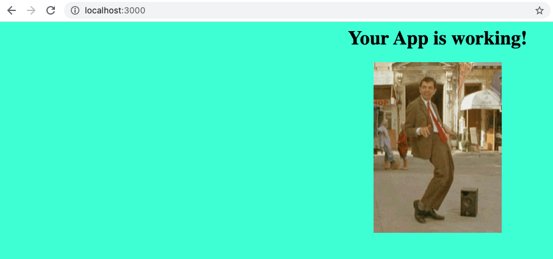

# Exercise 1 - Launch a Pod

In this exercise you will launch your first Pod. This exercise will also give
your first hands-on experience with the `kubectl` command line interface
(CLI).

The Pod we're launching is based on a simple web application written in JS. You
can check its code [here][JS App].

[JS App]: ../app/server.js

## I. Cluster access

Let's verify if we have access to the cluster and we can see Pods. For this purpose
we will list all the Pods present in the default namespace, via the command
`kubectl get pods`. You should get an output similar to the following:

```
$ kubectl get pods
NAME                                                READY     STATUS    RESTARTS   AGE
my-first-pod                                        1/1       Running   0          24m
```

## II. Create a YAML Pod Specification

We declare Pods through a YAML file. A very simple example is the following:

```yaml
apiVersion: v1
kind: Pod
metadata:
  name: CHANGE_ME
  labels:
    training: kubernetes-workshop
spec:
  containers:
  - name: main
    image: nginx
    env:
    - name: USER
      value: CHANGE_ME
    ports:
    - containerPort: 8080
    readinessProbe:
      httpGet:
        path: /health
        port: 8080
    resources:
      requests:
        cpu: "20m" # REQUESTED CPU: 20m cores
        memory: "20M" # REQUESTED MEM: 20MB
      limits:
        cpu: 0.5 # MAX CPU USAGE: 0.5 core
        memory: "20M" # MAX MEM USAGE: 20MB
```

Create a file `pod.yaml` with the contents above. Update it with the following
properties: 

* `name` - your name_surname
    - Pods __MUST__ have a unique name. Launching a Pod with the same name as
      one that is already present in the cluster will fail.
* `image` - our container will be based on the following image:
    - `kdusza/kubernetes-workshop`
* `path` of the `readinessProbe` -  [the code][Health endpoint] shows that we must change it to `/healthz`.
* `port` - the code shows that server is running on port `3000`

## III. Launch the Pod in the Cluster

To launch the Pod, type the command `kubectl apply -f <yaml-file>`, replacing
`<yaml-file>` with the file created in the previous step. When successful the
command returns with a message stating that the Pod was successfully created.

## IV. Verify that your Pod is Running

We use a command similar to what we used previously to list Pods, but this time
we give our Pod name - defined in Step 2 - as an argument:

```
kubectl get pod <pod-name>
```

You should get one line with your Pod, reporting a Status of `Running`.

__HINT__: Type `kubectl get pod <pod-name> -o yaml` to get detailed
information about your Pod in YAML format.

### Get the Pod's logs

Lets now check its logs, to verify it is running. Type:

```
$ kubectl logs <pod-name>
```

You will get an output similar to the following:

```
2021/04/16 13:31:46 Your pod is working! :D, request ->  1 ...
2021/04/16 13:31:51 Your pod is working! :D, request ->  2 ...
2021/04/16 13:31:56 Your pod is working! :D, request ->  3 ...
2021/04/16 13:32:01 Your pod is working! :D, request ->  4 ...
2021/04/16 13:32:06 Your pod is working! :D, request ->  5 ...
```

__HINT__: If you want to follow the logs - similar to using `tail -f` - use
`kubectl logs -f <pod-name>`

### Test Sending an HTTP Request

There is no way - at least for now -, to access this Pod from the public
internet. However, you can forward the Pod's port to your local machine. In
another terminal, execute:

```
$ kubectl port-forward <pod-name> 3000:3000
```

__NOTE__: Make sure port 3000 is available in your local machine. If not, try
with another port that's available.

You can now for example check the health endpoint using `curl` for example:

```
$ curl http://localhost:3000/healthz
ok
```

Or even access it from a [web browser](http://localhost:3000):



### Get Into the Pod

Finally, lets get inside our Pod. Similar to a
[Docker container][Docker example], we also can execute a shell using and
analogous command:

```
kubectl exec -it <pod-name> sh
```

Once inside we can check which processes are running:

```
/ # ps aux
PID   USER     TIME   COMMAND
    1 root       0:00 /training-example
   11 root       0:00 sh
   20 root       0:00 ps aux
```

[Docker example]: https://docs.docker.com/engine/reference/commandline/exec/#run-docker-exec-on-a-running-container

## Other Useful Commands

* `kubectl describe pod <pod-name>` - like `kubectl get pod`, but provides
   additional information like Events. Useful for debugging why a container is
   not starting;
* `kubectl delete pod <pod-name>` - deletes a single Pod.
